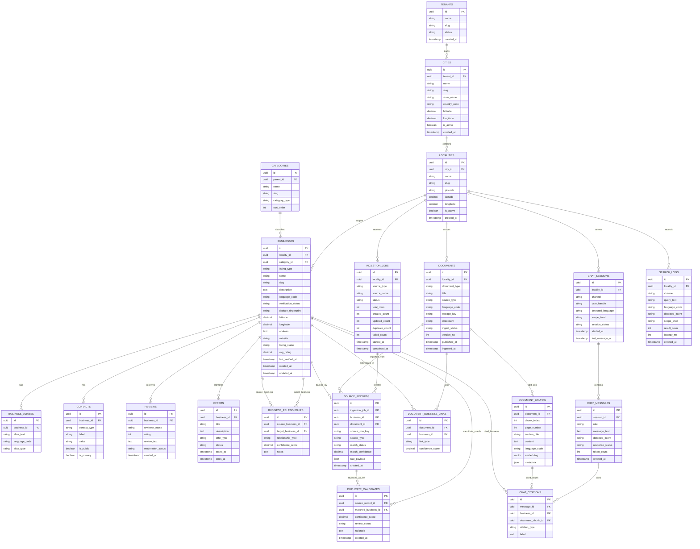

# Localisy - ER Diagram (v1)

This document defines the recommended v1 data model for Localisy as a multi-tenant hyperlocal business directory platform.

## Design Principles

- Primary operational tenant boundary is `locality`
- City pages and the national page are aggregate discovery layers
- Canonical business listings are separate from uploaded source rows
- Documents are first-class knowledge objects
- RAG runs on chunked document content
- Duplicate detection is explicit and reviewable
- Search and chat activity are auditable

## Mermaid ER Diagram

## Core Modeling Notes

## 1. Tenant, City, and Locality

- `tenants` can represent the owning account or operator group
- `localities` are the primary public-facing operational tenants
- `cities` group localities for aggregate discovery pages
- most operational data should be scoped by `locality_id`

## 2. Canonical Listing Model

- `businesses` stores the canonical, deduplicated listing
- `business_aliases` supports multilingual or alternate names
- `contacts` stores structured contact cards
- `reviews` and `offers` support richer directory experiences
- `business_relationships` makes the graph useful for RAG and navigation

## 3. Documents and RAG

- `documents` stores the source artifact
- `document_chunks` stores chunked retrieval units with embeddings
- `document_business_links` links document content back to canonical listings

## 4. Ingestion and Deduplication

- `ingestion_jobs` tracks each upload batch
- `source_records` stores raw imported row or source lineage
- `duplicate_candidates` stores probable listing matches for review or auto-resolution

## 5. Search and Chat Observability

- `chat_sessions` and `chat_messages` support Web, Mobile, and WhatsApp flows
- `chat_citations` preserves grounding references
- `search_logs` supports analytics, quality review, and latency measurement

## Recommended Indexes

- `businesses(locality_id, category_id, listing_type, verification_status)`
- `businesses USING GIN(to_tsvector(...))`
- `business_aliases(business_id, alias_text)`
- `documents(locality_id, source_type, ingest_status)`
- `document_chunks(document_id, chunk_index)`
- `document_chunks USING ivfflat (embedding vector_cosine_ops)`
- `source_records(ingestion_job_id, source_row_key)`
- `duplicate_candidates(source_record_id, review_status, confidence_score DESC)`
- `chat_sessions(locality_id, channel, last_message_at DESC)`
- `search_logs(locality_id, created_at DESC)`

## Open Decisions

- whether `tenants` are required in v1 or whether city plus locality is enough initially
- whether some high-volume listing types need dedicated subtype tables in v1
- whether contact privacy should split public vs restricted contact records into separate tables
